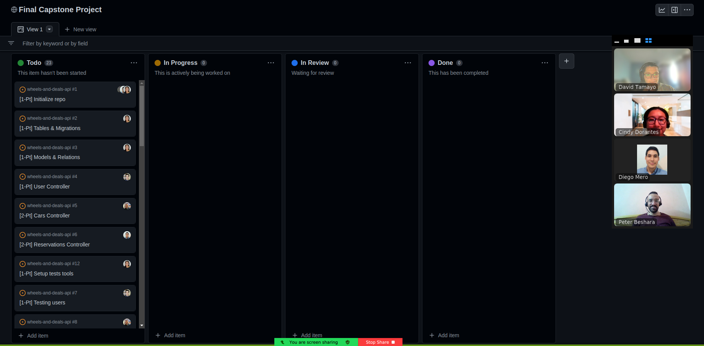

<a name="readme-top"></a>

<div align="center">
  
  <br/>

  <h2><b>WHEELS AND DEALS: REACT FRONT-END </b></h2>
  <br/>
</div>

<!-- TABLE OF CONTENTS -->

# Table of Contents 📑

- [📖 About the Project](#about-project)
  - [🛠 Built With](#built-with)
    - [Tech Stack](#tech-stack)
    - [Key Features](#key-features)
  - [📅 Project's Kanban Board](#kanban-board)
  - [🚀 Live Demo](#live-demo)
- [💻 Getting Started](#getting-started)
  - [Setup](#setup)
  - [Prerequisites](#prerequisites)
  - [Install](#install)
  - [Usage](#usage)
- [📷 Screenshots](#screenshots)
- [👥 Authors](#authors)
- [🤝 Contributing](#contributing)
- [⭐️ Show your support](#support)
- [🙏 Acknowledgements](#acknowledgements)
- [📝 License](#license)
<br/><br/>

<!-- PROJECT DESCRIPTION -->

# 📖 WHEELS AND DEALS: REACT FRONT-END <a name="about-project"></a>

> **Wheels and Deals** is an app to book an appointment to try a car. The user is able to see the list of cars available and their details, as well as book a reservation or add a new car. The user needs to create an account to access the options for reservations and add new cars. Build with React, the app uses a rails API as the backend.

<br/>

## 🛠 Built With <a name="built-with"></a>

### Tech Stack <a name="tech-stack"></a>

<details>
  <summary>Client</summary>
  <ul>
    <li><a href="https://reactjs.org/"></a></li>
    <li><a href="https://redux.js.org/"></a></li>
  </ul>
</details>

<br/>

<!-- Features -->

### Key Features <a name="key-features"></a>

- The user can create and account and log in
- A  navigation panel where the user can see the links to 'Cars', 'New Reservation', 'My Reservations', 'Add car', 'Delete car'
- When the user selects a specific car, they can see the details page with its full description
- In the details page, the user can click the "Reserve" button, and the reservation form will be autofilled with the selected car
- When the user clicks the "Add item" link in the navigation panel they can see a form for adding a new item.
- The app is responsive, both mobile and desktop versions have been created.

<p align="right">(<a href="#readme-top">back to top</a>)</p>

## 📅 Project's Kanban Board <a name="kanban-board"></a>

Kanban Board available [here](https://github.com/users/Peter1907/projects/3/views/1) 

The team of developers involved in the creation of this project is made up of 4 [authors](#authors).



<br/>

<!-- LIVE DEMO -->

## 🚀 Live Demo <a name="live-demo"></a>

- [Live Demo Link](https://google.com)

<p align="right">(<a href="#readme-top">back to top</a>)</p>

## 📷 Screenshots <a name="screenshots"></a>

  
  
  

<br/>

<p align="right">(<a href="#readme-top">back to top</a>)</p>

<!-- GETTING STARTED -->

## 💻 Getting Started <a name="getting-started"></a>

To get a local copy up and running, follow these steps.

### Prerequisites

In order to run this project you need:

- Node.js
- Visual Studio Code or similar source-code editor


### Setup

Clone this repository to your desired folder:

```sh
  cd my-folder
  git clone git@github.com:Peter1907/wheels-and-deals-react.git
```

### Install

Install this project with:

```sh
  cd wheels-and-deals-react
  npm install
```

### Usage

To run the project, execute the following command:

```sh
  npm start
```

<p align="right">(<a href="#readme-top">back to top</a>)</p>

<!-- AUTHORS -->

## 👥 Authors <a name="authors"></a>

 👤 **Cindy Dorantes**

- GitHub: [@CindyDorantes](https://github.com/CindyDorantes)
- Twitter: [@CindyDorantes10](https://twitter.com/CindyDorantes10)
- LinkedIn: [Cindy Melisa Dorantes Sánchez](https://www.linkedin.com/in/cindydorantessanchez/)

👤 **David Tamayo**

- GitHub: [@IngDavidTM](https://github.com/IngDavidTM)
- Twitter: [@David5TM](https://twitter.com/David5TM)
- LinkedIn: [David Tamayo](https://www.linkedin.com/in/ing-david-tamayo)

👤 **Diego Mero**

- GitHub: [@DiegoMero](https://github.com/DiegoMero)
- Twitter: [@Dimero18](https://twitter.com/Dimero18)
- LinkedIn: [Diego Mero](https://www.linkedin.com/in/diego-mero/)

👤 **Peter Beshara**

- GitHub: [@Peter1907](https://github.com/Peter1907)
- Twitter: [@Peter_Beshara_](https://twitter.com/Peter_Beshara_)
- LinkedIn: [Peter Beshara](https://www.linkedin.com/in/peter-beshara-b33681241/)

<p align="right">(<a href="#readme-top">back to top</a>)</p>

<!-- CONTRIBUTING -->

## 🤝 Contributing <a name="contributing"></a>

Contributions, issues, and feature requests are welcome!

Feel free to check the [issues page](../../issues/).

<p align="right">(<a href="#readme-top">back to top</a>)</p>

<!-- SUPPORT -->

## ⭐️ Show your support <a name="support"></a>

Give a ⭐️ if you like this project!
Also, you can reach out any [author](#authors), we will be glad to hear you.

<p align="right">(<a href="#readme-top">back to top</a>)</p>

<!-- ACKNOWLEDGEMENTS -->

## 🙏 Acknowledgments <a name="acknowledgements"></a>

- Thanks to our learning partners for their help and support
- Original design idea by [Nelson Sakwa on Behance](https://www.behance.net/sakwadesignstudio).

<p align="right">(<a href="#readme-top">back to top</a>)</p>

<!-- LICENSE -->

## 📝 License <a name="license"></a>

This project is [MIT](./LICENSE) licensed.

<p align="right">(<a href="#readme-top">back to top</a>)</p>