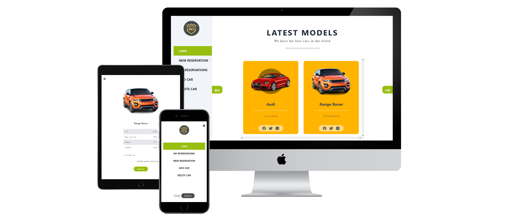
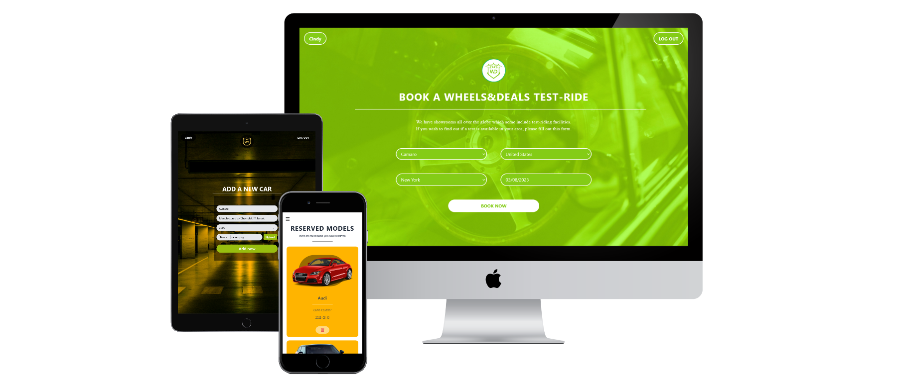

<a name="readme-top"></a>

<!--
HOW TO USE:
This is an example of how you may give instructions on setting up your project locally.
Modify this file to match your project and remove sections that don't apply.
REQUIRED SECTIONS:
- Table of Contents
- About the Project
  - Built With
  - Live Demo
- Getting Started
- Authors
- Future Features
- Contributing
- Show your support
- Acknowledgements
- License
OPTIONAL SECTIONS:
- FAQ
After you're finished please remove all the comments and instructions!
-->

<div align="center">
  <!-- You are encouraged to replace this logo with your own! Otherwise you can also remove it. -->
  
  <br/>

  <h2><b>WHEELS AND DEALS: REACT FRONT-END </b></h2>
  <br/>
</div>

<!-- TABLE OF CONTENTS -->

# Table of Contents 📑

- [📖 About the Project](#about-project)
  - [🛠 Built With](#built-with)
    - [Tech Stack](#tech-stack)
    - [Key Features](#key-features)
  - [🚀 Live Demo](#live-demo)
- [💻 Getting Started](#getting-started)
  - [Setup](#setup)
  - [Prerequisites](#prerequisites)
  - [Install](#install)
  - [Usage](#usage)
  - [Run tests](#run-tests)
  - [Deployment](#triangular_flag_on_post-deployment)
- [👥 Authors](#authors)
- [🔭 Future Features](#future-features)
- [🤝 Contributing](#contributing)
- [⭐️ Show your support](#support)
- [🙏 Acknowledgements](#acknowledgements)
- [❓ FAQ (OPTIONAL)](#faq)
- [📝 License](#license)
<br/><br/>

<!-- PROJECT DESCRIPTION -->

# 📖 WHEELS AND DEALS: REACT FRONT-END <a name="about-project"></a>

> **Wheels and Deals** is an app to book an appointment to try a car. The user is able to see the list of cars available and their details, as well as book a reservation or add a new car. The user needs to create an account to access the options for reservations and add new cars. Build with React, the app uses a rails API as the backend.

<br/>

## 🛠 Built With <a name="built-with"></a>

### Tech Stack <a name="tech-stack"></a>

<details>
  <summary>Client</summary>
  <ul>
    <li><a href="https://reactjs.org/"></a></li>
    <li><a href="https://redux.js.org/"></a></li>
  </ul>
</details>

<details>
  <summary>Server</summary>
  <ul>
    <li><a href="https://expressjs.com/">Express.js</a></li>
  </ul>
</details>

<details>
<summary>Database</summary>
  <ul>
    <li><a href="https://www.postgresql.org/">PostgreSQL</a></li>
  </ul>
</details>
<br/>

<!-- Features -->

### Key Features <a name="key-features"></a>

- The user can create and account and log in
- A  navigation panel where the user can see the links to 'Cars', 'New Reservation', 'My Reservations', 'Add car', 'Delete car'
- When the user selects a specific car, they can see the details page with its full description
- In the details page, the user can click the "Reserve" button, and the reservation form will be autofilled with the selected car
- When the user clicks the "Add item" link in the navigation panel they can see a form for adding a new item.
- The app is responsive, both mobile and desktop versions have been created.

<p align="right">(<a href="#readme-top">back to top</a>)</p>

<!-- LIVE DEMO -->

## 🚀 Live Demo <a name="live-demo"></a>

- [Live Demo Link](https://google.com)

<p align="right">(<a href="#readme-top">back to top</a>)</p>

## 📷 Screenshots

  
  
  

<br/>

<!-- GETTING STARTED -->

## 💻 Getting Started <a name="getting-started"></a>

To get a local copy up and running, follow these steps.

### Prerequisites

In order to run this project you need:

- Node.js
- Visual Studio Code or similar source-code editor


### Setup

Clone this repository to your desired folder:

<!--
```sh
  cd my-folder
  git clone git@github.com:Peter1907/wheels-and-deals-react.git
```
--->

### Install

Install this project with:

<!--
```sh
  cd wheels-and-deals-react
  npm install
```
--->

### Usage

To run the project, execute the following command:

<!--
```sh
  npm start
```
--->

### Run tests

To run tests, run the following command:

<!--
Example command:
```sh
  bin/rails test test/models/article_test.rb
```
--->

### Deployment

You can deploy this project using:

<!--
Example:
```sh
```
 -->

<p align="right">(<a href="#readme-top">back to top</a>)</p>

<!-- AUTHORS -->

## 👥 Authors <a name="authors"></a>

 👤 **Cindy Dorantes**

- GitHub: [@CindyDorantes](https://github.com/CindyDorantes)
- Twitter: [@CindyDorantes10](https://twitter.com/CindyDorantes10)
- LinkedIn: [Cindy Melisa Dorantes Sánchez](https://www.linkedin.com/in/cindydorantessanchez/)

👤 **David Tamayo**

- GitHub: [@IngDavidTM](https://github.com/IngDavidTM)
- Twitter: [@David5TM](https://twitter.com/David5TM)
- LinkedIn: [David Tamayo](https://www.linkedin.com/in/ing-david-tamayo)

👤 **Diego Mero**

- GitHub: [@DiegoMero](https://github.com/DiegoMero)
- Twitter: [@Dimero18](https://twitter.com/Dimero18)
- LinkedIn: [Diego Mero](https://www.linkedin.com/in/diego-mero/)

👤 **Peter Beshara**

- GitHub: [@Peter1907](https://github.com/Peter1907)
- Twitter: [@Peter_Beshara_](https://twitter.com/Peter_Beshara_)
- LinkedIn: [Peter Beshara](https://www.linkedin.com/in/peter-beshara-b33681241/)

<p align="right">(<a href="#readme-top">back to top</a>)</p>

<!-- FUTURE FEATURES -->

## 🔭 Future Features <a name="future-features"></a>

> Describe 1 - 3 features you will add to the project.
- [ ] **[new_feature_1]**
- [ ] **[new_feature_2]**
- [ ] **[new_feature_3]**

<p align="right">(<a href="#readme-top">back to top</a>)</p>

<!-- CONTRIBUTING -->

## 🤝 Contributing <a name="contributing"></a>

Contributions, issues, and feature requests are welcome!

Feel free to check the [issues page](../../issues/).

<p align="right">(<a href="#readme-top">back to top</a>)</p>

<!-- SUPPORT -->

## ⭐️ Show your support <a name="support"></a>

Give a ⭐️ if you like this project!
Also, you can reach out any author, we will be glad to hear you.

<p align="right">(<a href="#readme-top">back to top</a>)</p>

<!-- ACKNOWLEDGEMENTS -->

## 🙏 Acknowledgments <a name="acknowledgements"></a>

- Thanks to our learning partners for their help and support
- Original design idea by [Nelson Sakwa on Behance](https://www.behance.net/sakwadesignstudio).

<p align="right">(<a href="#readme-top">back to top</a>)</p>

<!-- FAQ (optional) -->

## ❓ FAQ (OPTIONAL) <a name="faq"></a>

> Add at least 2 questions new developers would ask when they decide to use your project.
- **[Question_1]**

  - [Answer_1]

- **[Question_2]**

  - [Answer_2]

<p align="right">(<a href="#readme-top">back to top</a>)</p>

<!-- LICENSE -->

## 📝 License <a name="license"></a>

This project is [MIT](./LICENSE) licensed.

_NOTE: we recommend using the [MIT license](https://choosealicense.com/licenses/mit/) - you can set it up quickly by [using templates available on GitHub](https://docs.github.com/en/communities/setting-up-your-project-for-healthy-contributions/adding-a-license-to-a-repository). You can also use [any other license](https://choosealicense.com/licenses/) if you wish._

<p align="right">(<a href="#readme-top">back to top</a>)</